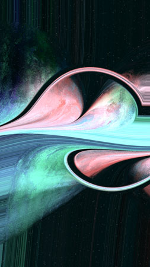

# About Lumina
"Lumina" is an exploration into the vast narratives of the universe, where each celestial formation tells a unique story shaped by cosmic phenomena. This project captures and condenses the essence of these expansive temporal actions into singular moments for viewers. It vividly portrays gravitational lensing, the spacetime continuum, and the intricate fabric of space, showcasing the mesmerizing interplay of light and space as they are twisted and refracted by gravity. "Lumina" is not only a reflection of cosmic phenomena but also a metaphor for human exploration and discovery. As technology propels us further into space, this collection serves as an artistic parallel, emphasizing humanity's enduring quest to understand and connect with the cosmos. The urge for exploration in both space and technology runs parallel to the innate human drive to push new frontiers in art. With emerging technologies, we continually push further, exploring new methods and tools that expand our artistic possibilities and expressions.

# Making of Lumina

Lumina is a further exploration of using p5.js and WebGL shaders together to generate a striking visual style that maintains a balance between organic and digital elements. We employed a **serial** technique to structure the process.

In this project, we created basic shapes using `vertex()` & `curveVertex()` functions in p5.js. Later, these shapes were processed through an FBM (Fractal Brownian Motion) shader to create a cloudy texture. This cloudy texture was then passed into another shader, which applied a swirl effect to it. For the final process, we used a custom shader to manipulate the canvas, creating fractured and bent entities. 

## Detailed explanation of the **serial** process

1. Creating shapes using `vertex()` & `curveVertex()` in p5.js

    

2. First shader; **FBM** and adding **light**

    
   
3. Second Shader; **Swirl**, giving some movement

    

4. Last Shader; **Spatialize**, manipulating the canvas to create a fractured, bent and warped cosmic entities

    

5. For a final touch, adding **stars**

    

## Compositions 

The visual structure contains 9 general composition type depicting the phenomena of gravitational pull & lensing, fracting and bending of time and space and how gravity warps light.

Each composition is highly varied, some examples;

* Composition 1

  

* Composition 2

  

* Composition 3

  

* Composition 4

  

* Composition 5

  

* Composition 6

  

* Composition 7

  

* Composition 8

  

* Composition 9

  

# About Coloring

The color algorithm is divided into two parts. The first part selects two hues, while the second part adds additional hues based on a specific hash value. If the first part of the algorithm selects two identical hues, the second part will always introduce additional hues to ensure variety. There are 9 different hues in total

These selected hues are then applied to the basic shapes created in the project. The FBM shader adds light to the intersecting areas of these basic shapes.

In the fourth step, the final shader amplifies the brightness and saturation of the colors based on a random hash value. This process brings out a rich variety in the coloring structure of the artwork.

# About Us
DistCollective, also known as DistC., is a multidisciplinary artist duo based in Istanbul, founded in 2019 by Bilge and Ilgın İçözü. Their work is characterized by deep exploration of the organic elements of computational aesthetics, achieved through the use of generative algorithms. The duo's passion for exploring new forms of expression with modern technologies has led them to work in a wide range of fields such as music, animation, visual, and generative art.

Their first exhibition as a duo was held in Istanbul by Akbank Sanat in 2022. Following that, they participated in an interactive exhibition (live minting experience with long-form generative collection) at Art Basel Miami 2022 in collaboration with the Tezos Foundation and fx(hash). They also joined Proof of People's live minting experience with their long-form generative collection in New York in 2023. Their works have been exhibited in art fairs and galleries in Turkey, the United States, the United Kingdom, Spain, and Italy.

DistCollective's artistry is driven by curiosity and a desire to learn about nature through the process of creation.Their collaboration with computers enhances their exploration, leading them to unanticipated discoveries and aiding them in comprehending the essence of nature and the mathematics behind it. They focus on exploring organic textures and forms, shaping randomness through generative algorithms, and collaborating with computers to find bridges between art, technology and nature. Their goal is to find a balance between the organic elements in nature and computers, pushing the boundaries of what is considered organic and exploring new frontiers in the digital world.

Their portfolio includes a diverse range of collections, each with its unique theme and aesthetic. These include "Spatial Curvatures", a visualization of the warping, bending, and fracturing of light and space fabric caused by gravity, “Aesthetics of Failure”, an exploration of the organic fusion of contrasting textures and seeking beauty within this blend, "Udnē", part of the fxhash interactive minting experience at Performance in Code: Deciphering Value in Generative Art, Art Basel Miami Beach, 2022, and "Brutal Infection", part of the Blind Gallery Seed Edition. Other collections include "Mina", a generative series of asymmetric compositions, "Refractions", a study of frequencies, harmonies, and abstract representations of natural phenomena, and "Solitude", a study of negative space, contrast, and void.

DistCollective completed their residency program as the 5th cohort with Vertical Crypto Art in 2023 and actively participates as a mentor in the program.The duo continues their exploration of new frontiers in the digital realm and is constantly seeking innovative ways to engage and share their work with their audience.

For more information about us and our works, you can visit; distcollective.xyz

